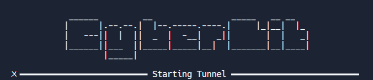

> Just to make my life easier, Im making a template repl to use for all my future cyber security event labs. This is the bare bones / foundation stone of all the labs which are mostly from either VulHub or YouTube. 

## Important Prequisties w/ Installation Commands 

* Docker (One-click Installation)

  *  Install with`curl -s https://get.docker.com/ | sh`
* Docker-compose
  * Install PIP `curl -s https://bootstrap.pypa.io/get-pip.py | python3` Then
  * Install Docker-compose `pip install docker-compose`
* Vulhub Labs
  * Clone with `git clone https://github.com/vulhub/vulhub.git` or
  * [Visit Here to view in another tab](https://github.com/vulhub/vulhub)

## Post Fork Configuration
For each lab Im making, I will be forking this repl and:
1. Adding the `docker-compose.yaml` file and all the relevant content from a specific lab from VulHub
2. Edit `Startup.sh` to change the startup command, if required (check lab specific vulhub readme)
3. Press the big green `Run` Button!!

## Bruh Moments (Errors)
Oh whats that? Ngrok Token and Region? 
> Make an account and add the required Secrets - `ngrok_token` and `ngrok_region`

Oh whats that? Default CyberLit WebPage?
> #todo

## Idea and Logic
Just in case I abandon this project for a year or whatever, Im explaining the logic and the intended purpose (in terms of code) of this template so I can read it and not be shocked. Most of the labs and events are for a very cyber-beginner audience which means very beginner friendly content which means very easy vulnerabilities and hacking labs which means web servers. 

By default, replit ships all its HTTP servers with a lil "s" in the end; which makes it secure which means `webserver != beginnerFriendly`. At first, I wanted to make a repl or a team which bypasses the sentry and the SSL encryption or even a whole seperate CyberLit Cluster but that requires demand from customers and I dont have any of that. So I went for a diffrent approach which is NGROK!!! We can use NGROK TCP tunneling to forward all the incoming and outgoing web traffic to any lab without any "too secure to hack" issues.  

Yea thats cool and all but what about the labs? The labs are essentially mostly virtual machines and pre-configured operating systems for me to conduct but they cant run on a 2G Ram and 1G SSD... HMMMM ---- OH I KNOW!!! Use waht replit used before ---- DOCKER CONTAINERS (but within itself). I found this really cool open source organisation called VulHub which lets users create their own vulnerable environments using docker-compose. I can just fork it this template, move all the contents of a specific lab I want to talk about in an event and move it to the `Lab` folder to bootstrap it faster than my dad dropped me as a child D:

## Credits

Replit, God, Jesus (Catholic Jesus), Vulhub. 